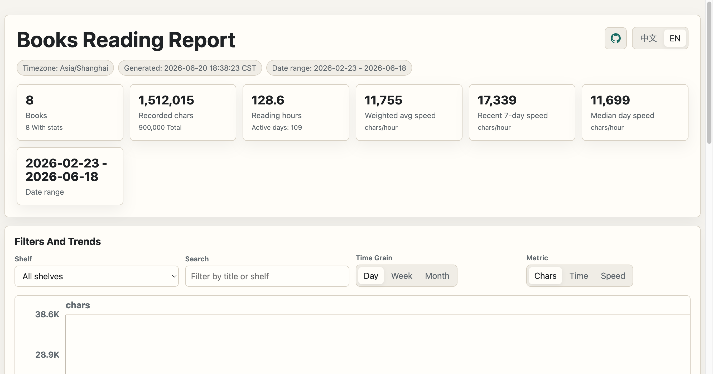

# Japanese Reading Stats

Generate a local HTML report from reading statistics produced by
[Hoshi Reader Desktop](https://github.com/Manhhao/Hoshi-Reader-Desktop).
The default source belongs to `/Applications/Hoshi Reader.app` (bundle ID
`de.manhhao.hoshi`). The parser also supports the legacy daily data layout used by
[Hoshi Reader Mac](https://github.com/W1ght/Hoshi-Reader-Mac) and
[ebook-reader](https://github.com/ttu-ttu/ebook-reader).

The report focuses on reading progress, reading time, and reading speed changes.
It is intentionally static: one Python command reads the JSON files and writes a
self-contained HTML report.

## Preview



## Usage

```bash
uv run scripts/visualize_books.py
```

By default, this reads Hoshi Reader Desktop data from:

```text
~/Library/Application Support/de.manhhao.hoshi/Books
```

and writes:

```text
output/books_reading_report.html
```

Common options:

```bash
uv run scripts/visualize_books.py \
  --books-dir "$HOME/Library/Application Support/de.manhhao.hoshi/Books" \
  --output output/books_reading_report.html \
  --timezone Asia/Shanghai \
  --day-start-hour 5 \
  --top 20
```

Each book's `statistics.json` contains sessions keyed by ID, with a `modified`
timestamp and a `value` containing `startedAt`, `endedAt`, `charactersRead`, and
`readingTime` (seconds). Deleted records (`value: null`) are excluded. The whole
session is assigned to the date of its start time minus the daily reset offset,
matching Hoshi Reader Desktop. The default is **05:00**: a session starting
before 05:00 belongs to the previous day; one starting at 05:00 belongs to the
current day. A session crossing 05:00 still belongs entirely to its start day.
Set `--timezone Asia/Shanghai` for Shanghai time, or `--day-start-hour 0` for a
midnight reset. The report displays the selected day boundary. Filtering is
applied to each session: records shorter
than 60 seconds or with no positive character count are excluded by default.

Book totals and shelf memberships can come from `metadata.json`; `bookinfo.json`
is optional. Legacy daily arrays remain supported when selecting another source
with `--books-dir`, for example `"$HOME/Library/Application Support/Books"`.
Legacy daily records retain their existing `dateKey`, since their session times
are unavailable. Hoshi Reader's `statisticsResetTime` is an app preference, not
a field in each session; this report uses its own explicit day boundary option.

## Publishing to GitHub Pages

You can opt in to publishing the generated report to a branch for GitHub Pages:

```bash
uv run scripts/visualize_books.py \
  --books-dir "$HOME/Library/Application Support/de.manhhao.hoshi/Books" \
  --publish-pages
```

By default this infers the profile name from the Books data directory name, then
pushes a static site branch named `reports/<profile>`. For the default path, the
branch is `reports/Books`.

The published branch contains only:

- `index.html`: a small landing page linking to the report
- `books_reading_report.html`

Publishing options:

- `--publish-pages`: enable the publish step after local report generation
- `--pages-remote`: git remote to push to, default `origin`
- `--pages-branch-prefix`: branch prefix, default `reports/`
- `--profile-name`: override the inferred profile name

One-time GitHub Pages setup:

1. Open the repository on GitHub.
2. Go to `Settings -> Pages`.
3. Set `Build and deployment` to `Deploy from a branch`.
4. Select the generated branch, for example `reports/Books`.
5. Select folder `/root`.

The report HTML contains your book titles, shelf names, and reading statistics.
If the repository is public, the published GitHub Pages site is public too.

## What It Shows

- Total books, total characters, recorded characters read, reading hours, active
  days, and reading date range
- Daily, weekly, and monthly trends for characters read, reading time, and
  weighted average reading speed
- Raw reading speed and moving average speed, with outlier speed days marked
- Book rankings by characters, time, speed, and progress
- Shelf summaries
- Book and shelf rankings by characters, time, speed, and progress

Reading speed is calculated as `charactersRead / readingTime` and displayed as
characters per hour. For legacy daily records, the report also keeps the original
speed fields in chart tooltips. Session records retain their IDs and start/end
timestamps in the embedded report data.

## Files

- `scripts/visualize_books.py`: report generator and CLI
- `tests/`: focused parser and aggregation tests
- `output/`: generated report files, ignored by git
